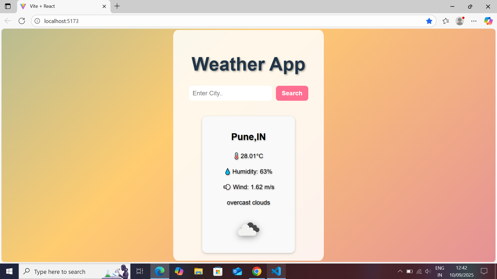

# 🌤️ React Weather App

A simple and stylish weather app built with **React** and the [OpenWeather API](https://openweathermap.org/api).  

## 🚀 Features
- Search weather by city name  
- Displays temperature, humidity, wind speed  
- Dynamic background based on weather condition  
- Responsive & mobile-friendly  

## 🛠️ Technologies
- React (useState, props, fetch API)  
- OpenWeather API  
- CSS (gradient + glassmorphism effects)  

## 📸 Screenshot


## 🔑 Setup
1. Clone this repo:
   ```bash
   git clone https://github.com/YOUR_USERNAME/react-weather-app.git
